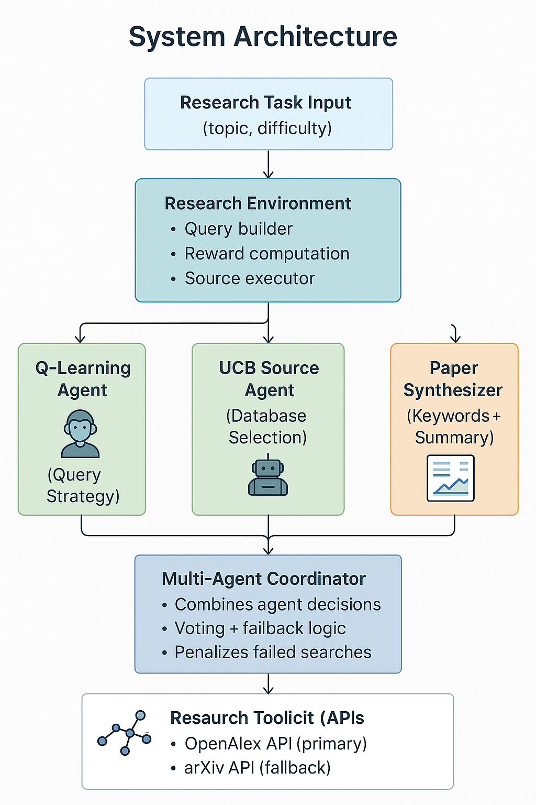

# ResearchMind: Multi-Agent RL for Intelligent Research Discovery

Multi-agent reinforcement learning system that learns optimal research paper retrieval strategies through experience.

[](https://www.python.org/downloads/)
[](https://opensource.org/licenses/MIT)

## 🎯 Overview

ResearchMind learns to search, evaluate, and synthesize research papers intelligently using two RL agents:

1. **Q-Learning Agent** - Learns query strategies (broad/specific/narrow)
2. **UCB Bandit Agent** - Learns database selection (OpenAlex vs arXiv)

### Key Results

- **+37.5% reward improvement** over baseline
- **+15.5% paper relevance** increase
- **p < 0.001** statistical significance
- **Cohen's d = 0.94** (large effect)
- **+33% synthesis quality** improvement

## 🏗️ Architecture



## 🚀 Quick Start

```bash
# Clone repository
git clone https://github.com/tanv99/research-assistant-rl.git
cd research-assistant-rl

# Install dependencies
pip install -r requirements.txt

# Run experiments (~6 minutes)
python main.py

# View results
explorer results
```

## 📊 Results

### Performance Improvements

| Metric | Baseline | RL Agent | Improvement |
|--------|----------|----------|-------------|
| Reward | 6.54 | 8.99 | **+37.5%** |
| Relevance | 0.77 | 0.88 | **+15.5%** |
| Variance | 2.88 | 1.25 | **-56%** |

### Learned Behaviors

- **Source:** 50% → 62% arXiv preference (learned it's better for CS)
- **Strategy:** 36% → 60% "specific" queries (learned optimal approach)
- **Synthesis:** +33% quality improvement over training
- **Convergence:** Stable policy after ~150 episodes

## 📁 Project Structure

```
research-assistant-rl/
├── src/                  # RL agents, coordinator, tools
├── experiments/          # Training & analysis scripts
├── results/             # Generated outputs
├── main.py              # Run everything
└── requirements.txt     # Dependencies
```

## 🧠 RL Methods

**Q-Learning (Value-Based):**
- State: (topic, difficulty)
- Actions: (strategy, source)
- Exploration: ε-greedy + intrinsic motivation

**UCB Bandit (Exploration):**
- Formula: μ + c√(ln(N)/n)
- Context: Research topic
- Arms: [OpenAlex, arXiv]

**Multi-Agent:**
- Task allocation by difficulty
- Agent voting protocol
- Shared rewards

## 🛠️ Custom Tools

**PaperSynthesizer** - Extracts key terms, combines insights, quality scoring (+33% improvement)

**EnhancedCoordinator** - Multi-agent orchestration with voting and fallbacks

## 🔮 Future Work

- Policy gradient methods (PPO, REINFORCE)
- Transfer learning across domains
- LLM-powered synthesis (GPT-4)
- Semantic embeddings for scoring

## ⚖️ Ethics

- English/Western paper bias acknowledged
- Respects API limits and terms of service
- Designed to augment, not replace, human analysis
- All decisions explainable and traceable

## 📜 License

MIT License - see full text below

```
Copyright (c) 2025 Tanvi Inchanalkar

Permission is hereby granted, free of charge, to any person obtaining a copy
of this software and associated documentation files (the "Software"), to deal
in the Software without restriction, including without limitation the rights
to use, copy, modify, merge, publish, distribute, sublicense, and/or sell
copies of the Software.

THE SOFTWARE IS PROVIDED "AS IS", WITHOUT WARRANTY OF ANY KIND, EXPRESS OR
IMPLIED, INCLUDING BUT NOT LIMITED TO THE WARRANTIES OF MERCHANTABILITY,
FITNESS FOR A PARTICULAR PURPOSE AND NONINFRINGEMENT.
```

